МІНІСТЕРСТВО ОСВІТИ І НАУКИ УКРАЇНИ
ХАРКІВСЬКИЙ НАЦІОНАЛЬНИЙ ЕКОНОМІЧНИЙ УНІВЕРСИТЕТ 
ІМЕНІ СЕМЕНА КУЗНЕЦЯ

ЗВІТ
 про виконання лабораторної роботи № 1
з дисципліни «Мобільні технології»
за  темою «Дослідження система контроля версій GIT та налагодження оточення Java/Kotlin розробника»

Виконав: 
студент 4 курсу 
групи 6.04.121.010.21.03 
навчально-наукового інституту 
інформаційних технологій 
Волошко К.І.

Перевірив:
Доцент кафедри ІС
Поляков А.О.

Харків – 2024

Тренінг Learn Git Branching

Рис 1.1 Результат тесту 1
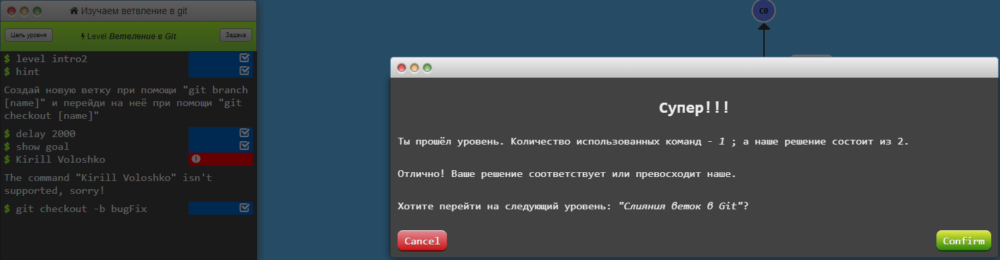
Рис 1.2 Результат тесту 2
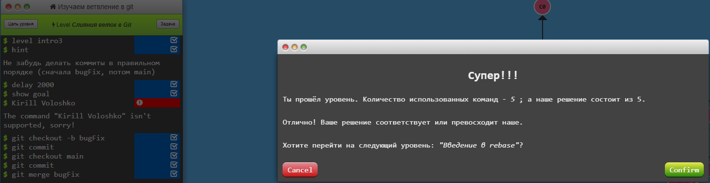
Рис 1.3 Результат тесту 3
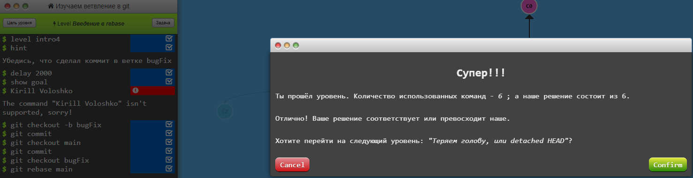 
Рис 1.4 Результат тесту 4

 
Рис 1.5 Результат тесту 5
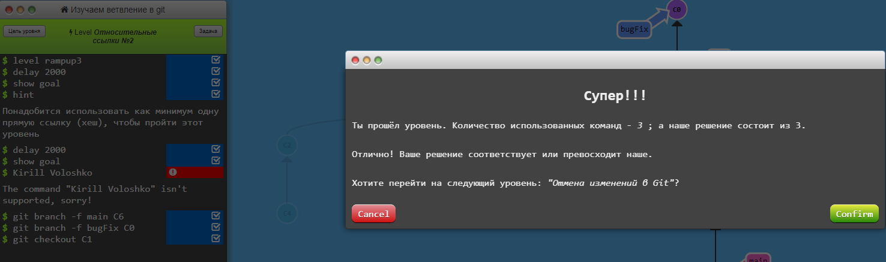 
Рис 1.6 Результат тесту 6
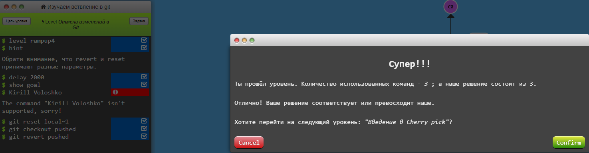 
Рис 1.7 Результат тесту 7
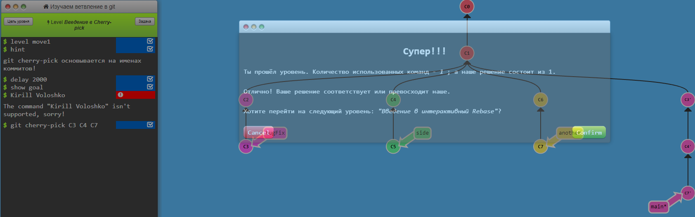 
Рис 1.8 Результат тесту 8
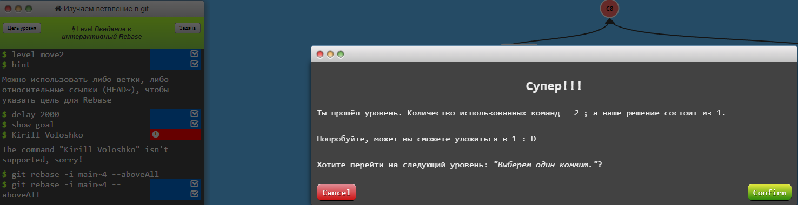 
Рис 1.9 Результат тесту 9
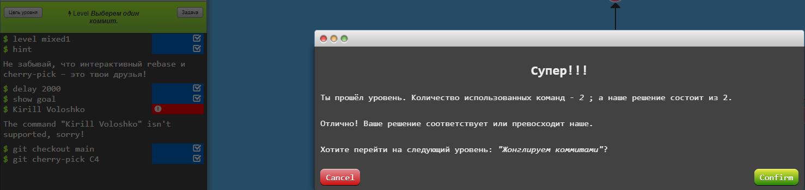 
Рис 1.10 Результат тесту 10
 
Рис 1.11 Результат тесту 11
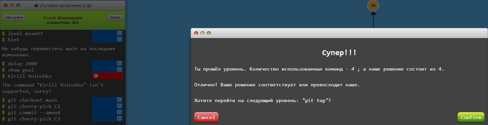 
Рис 1.12 Результат тесту 12
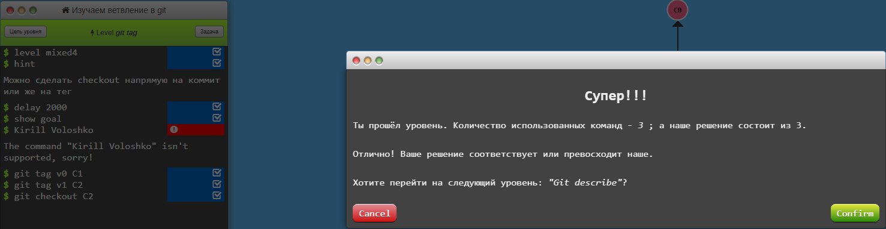
Рис 1.13 Результат тесту 13
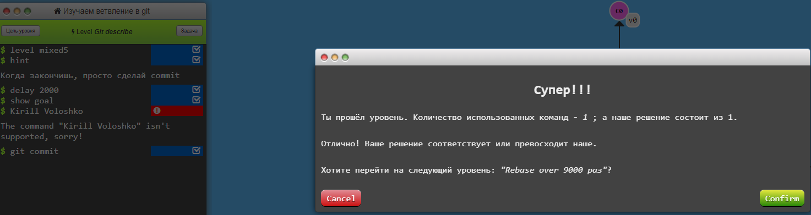 
Рис 1.14 Результат тесту 14
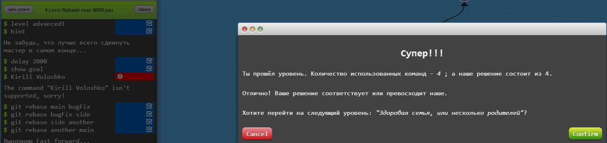 
Рис 1.15 Результат тесту 15
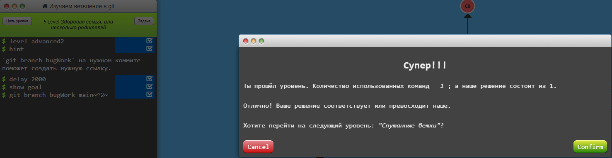 
Рис 1.16 Результат тесту 16
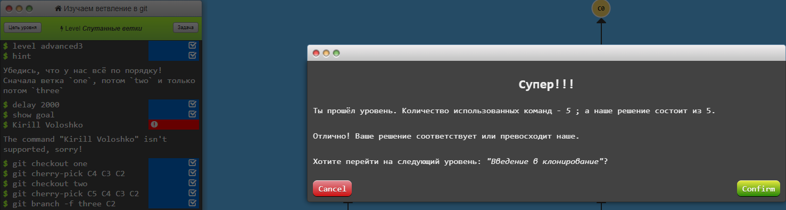
Рис 1.17 Результат тесту 17
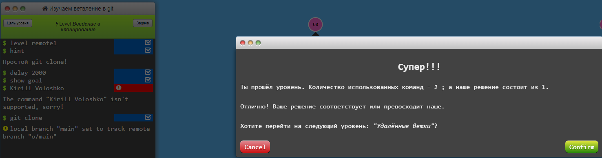 
Рис 1.18 Результат тесту 18
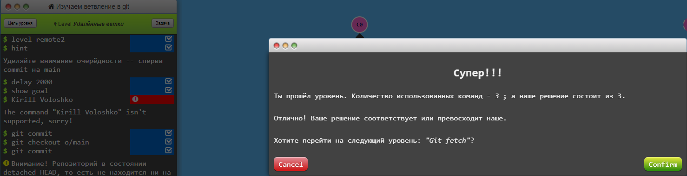 
Рис 1.19 Результат тесту 19
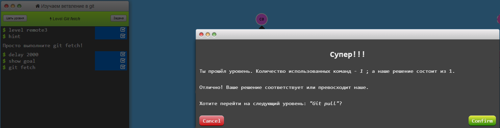 
Рис 1.20 Результат тесту 20
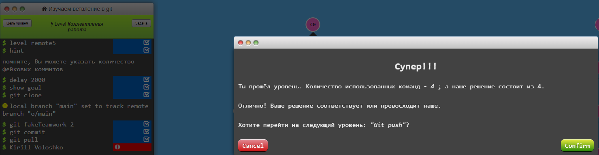
Рис 1.21 Результат тесту 21
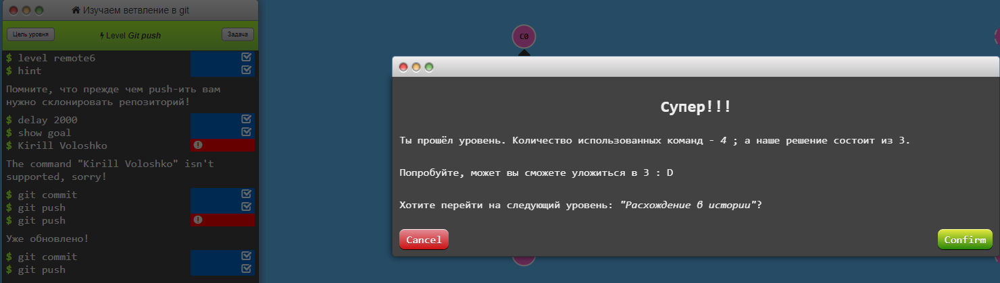
Рис 1.22 Результат тесту 22
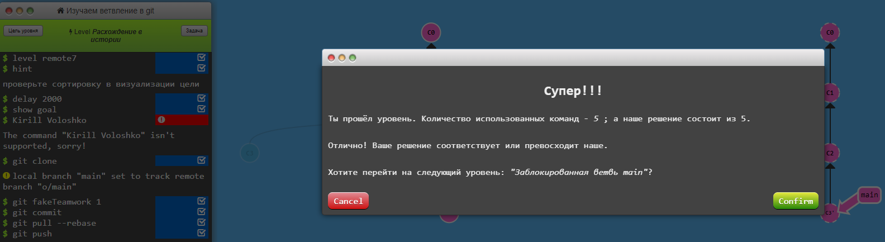 
Рис 1.23 Результат тесту 23
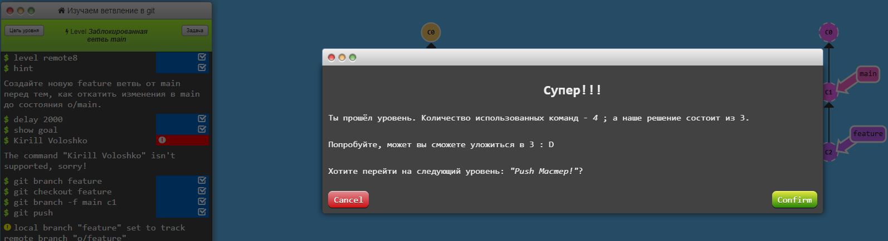 
Рис 1.24 Результат тесту 24
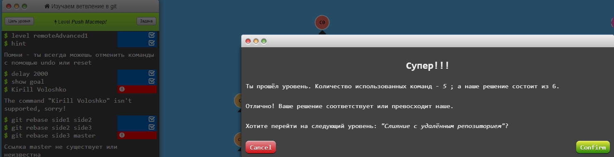 
Рис 1.25 Результат тесту 25
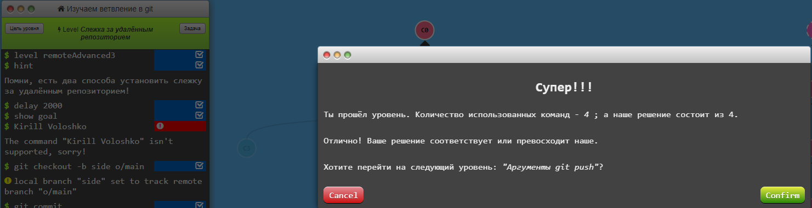 
Рис 1.26 Результат тесту 26
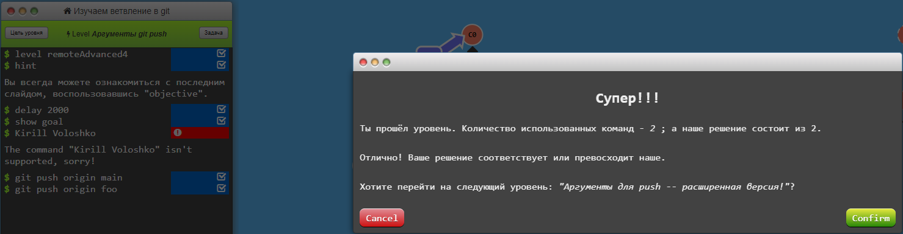 
Рис 1.27 Результат тесту 27
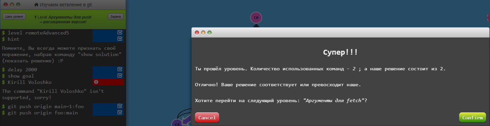 
Рис 1.28 Результат тесту 28
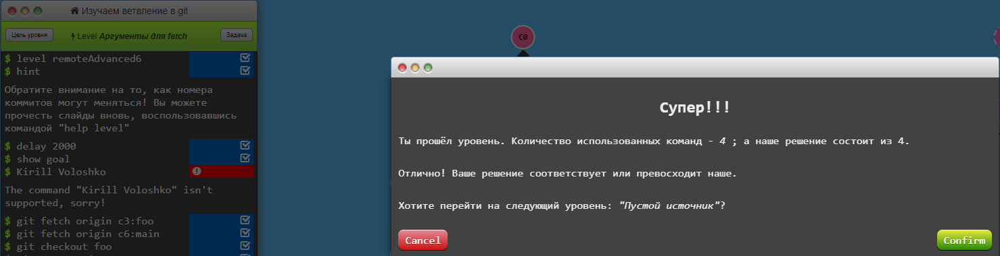
Рис 1.29 Результат тесту 29
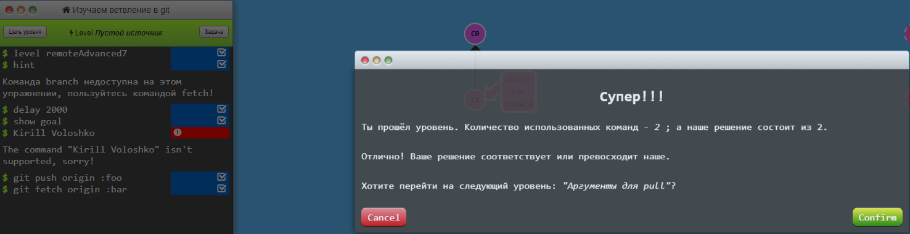 
Рис 1.30 Результат тесту 30
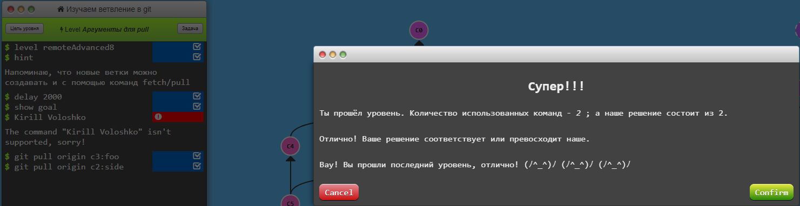 
Рис 1.31 Результат тесту 31
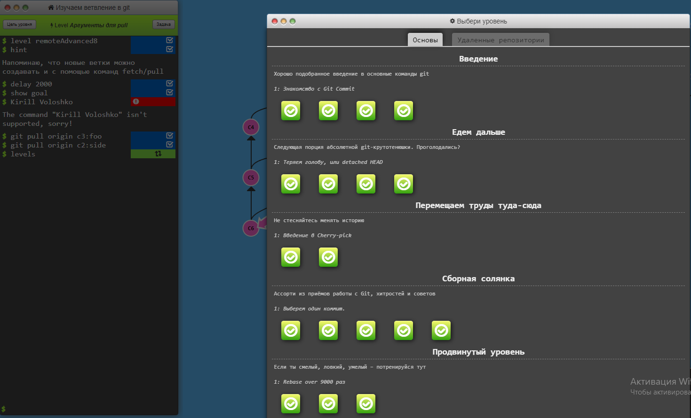
Рис 1.32 Загальний результат
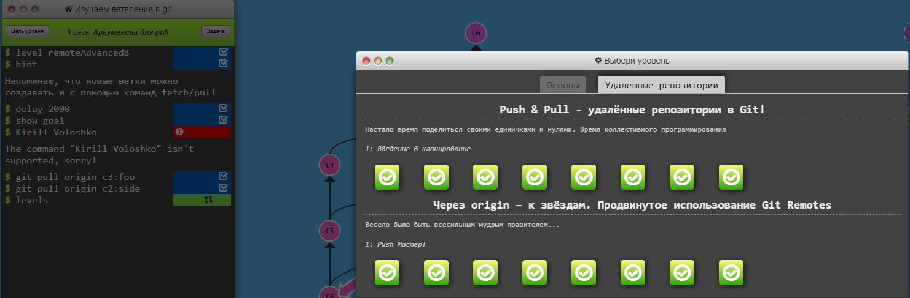 
Рис 1.33 Загальний результат
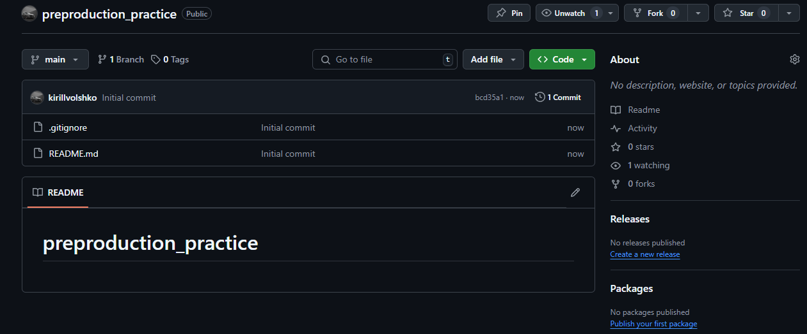

Part 1 (60-75%)
1.	Установить GIT на свою робочу станцію
2.	Налаштування git: змініть свої глобальні конфігурації (додайте ім'я та електронну пошту, налаштуйте основний текстовий редактор).
3.	Встановіть та налаштуйте інструмент diff & merge (див. посилання у вкладених лекціях).
5.	Створіть новий проект «preproduction_practice» (або проект з назвою, вказаною шаблоном, тобто «Group-Last_Name» – запитайте у свого керівника лабораторії деталі) на GitLab.
6.	Проект клонування на вашу робочу станцію.
7.	Надайте доступ для викладача до вашого репозиторію на Gitlab (як розробник).
8.	Створіть файл ".gitignore". Включіть ".gitignore" у власний список. Спробуйте використовувати різні шаблони у файлі .gitignore (див. у лекції), щоб зробити невидимими для git деякі локальні файли, які не слід робити. Переконайтеся, що файли, згадані у файлі .gitignore, не повинні бути видимими за допомогою команди git status.

 
Рис 1.34 Результат Part 1

Part 2 (75-85%)
1.	Відкрийте git консоль в кореневому каталозі вашого проекту і виконайте наступні дії.
2.	Всі свої експерименти робіть в папці "Lab-01-GIT".
3.	Створити пустий файл README.md.
4.	Зробіть init фіксацію.
5.	Створіть dev гілку і зробити на неї switch.
6.	Створення index.html пустого файлу. Commit.
7.	Створити гілку з назвою «images». Перейдіть на неї. Додайте кілька тек із зображеннями всередині неї. Commit.
8.	Змініть index.html. Додайте всередину нього джерело зображення. Зробити.
9.	Повернутися назад до develop гілки.
10.	Створити гілку з назвою «styles». Додайте теку "Деякі стилі" з джерелом стилів всередині неї. Commit.
11.	Змініть свій index.html. Commit.
12.	Перейти до develop гілки.
13.	Об'єднайте дві нові гілки в розробку за допомогою команди злиття git. Вирішити конфлікт, якщо він з'явиться. Робіть це в наступній послідовності:
•	merge “images” into “develop”
•	merge “styles” into “develop”
1.	Не видаляйте жодних гілок!
2.	Об'єднати develop в master.
3.	Оформити замовлення на розробку гілки і повторити ще раз 7-15 пунктів (використовуйте назви «images2», «styles2» для нових гілок). Now use git rebase command instead of git merge in step 13. Перебазуйте в наступній послідовності:
•	rebase “images2” на “develop”
•	rebase (fast-forward) “develop” на “images2”
•	rebase “styles2” на ‘’develop’
•	rebase (fast-forward) “develop” на “styles2”
1.	Об'єднуватися develop в master.

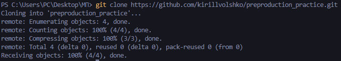 
Рис 1.35 Клонування репо локально

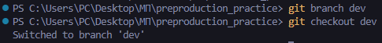 
Рис 1.36 Стоврення та перехід на branch dev
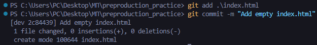 
Рис 1.37 Додавання index в область підготовлених файлів та створення коментаря для репо
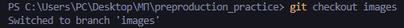 
Рис 1.38 Перехід на branch images
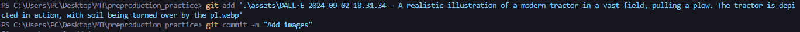 
Рис 1.39 Додавання img в область підготовлених файлів та створення коментаря для репо
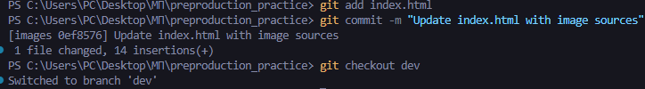 
Рис 1.40 Додавання index в область підготовлених файлів та створення коментаря для репо
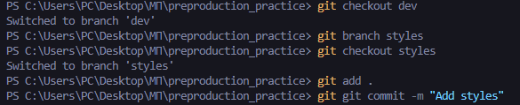 
Рис 1.41 Стоврення та перехід на branch dev Додавання styles в область підготовлених файлів та створення коментаря для репо
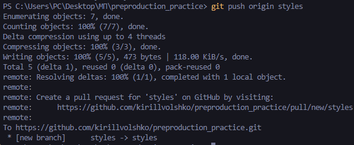 
Рис 1.42 Відправка змін до репо
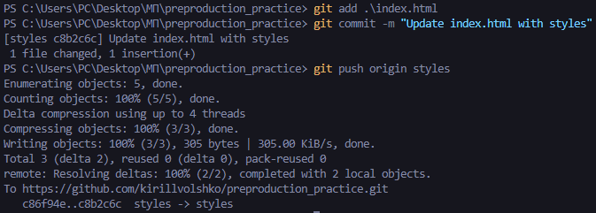 
Рис 1.43 Додавання index в область підготовлених файлів та створення коментаря для репо и відправка змін до репо
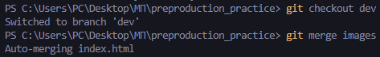 
Рис 1.44 Перехід на branch dev і merge гілки images
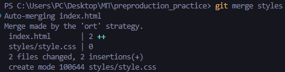 
Рис 1.45 Merge гілки styles

 
Рис 1.45 Перехід на основну гілку та merge з dev
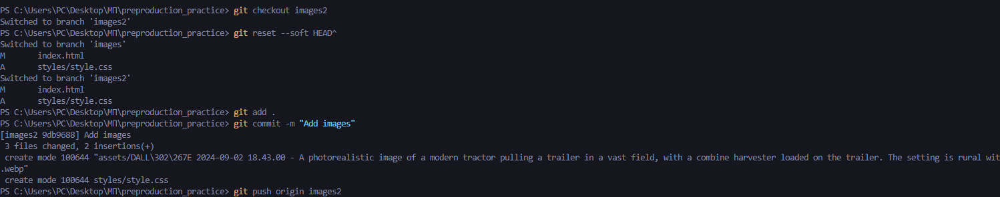 
Рис 1.46 Створення гілки image2 та перехід на branch images2
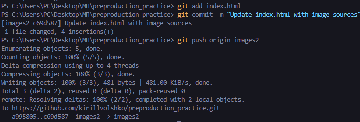 
Рис 1.47 Додавання img в область підготовлених файлів та створення коментаря для репо
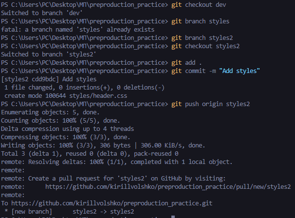 
Рис 1.48 Стоврення та перехід на branch dev Додавання styles в область підготовлених файлів та створення коментаря для репо
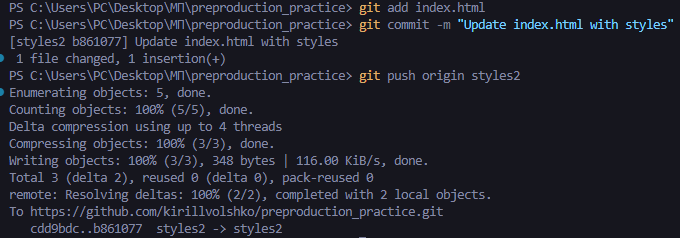
Рис 1.49 Додавання index в область підготовлених файлів та створення коментаря для репо и відправка змін до репо

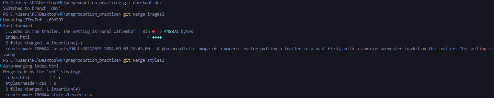 
Рис 1.50 Перехід на branch dev і merge гілки images та merge гілки styles
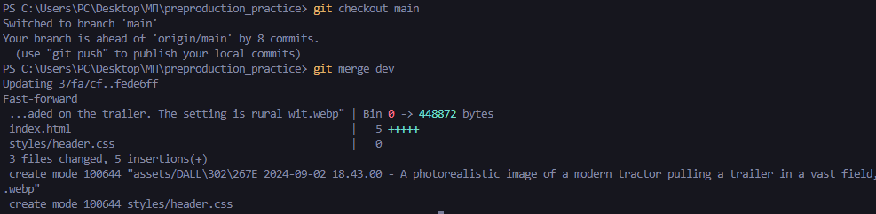 
Рис 1.51 Перехід на основну гілку та merge з dev
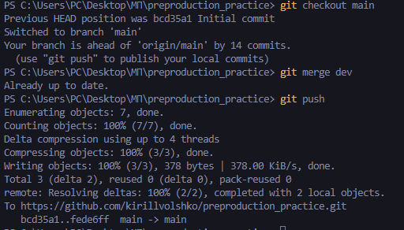 
Рис 1.52 Відправка змін до репо
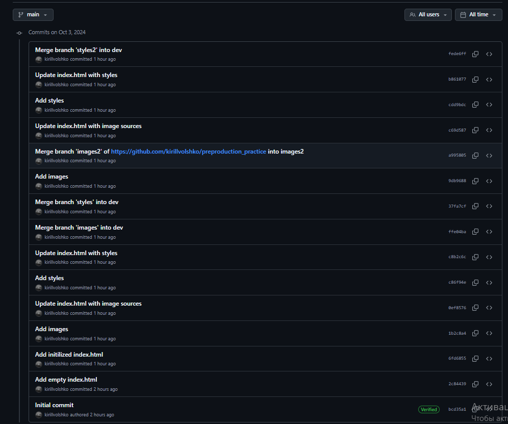 
Рис 1.53 Результат Part 2
